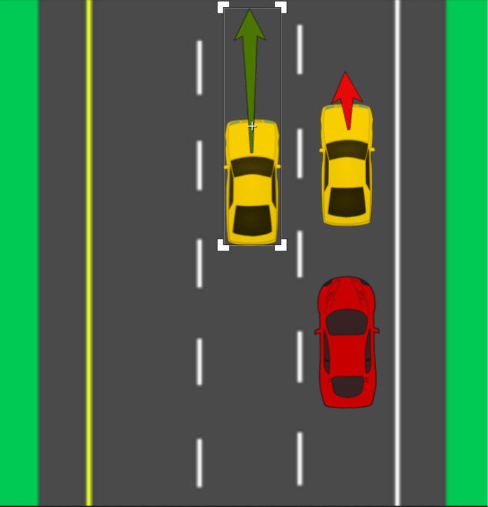
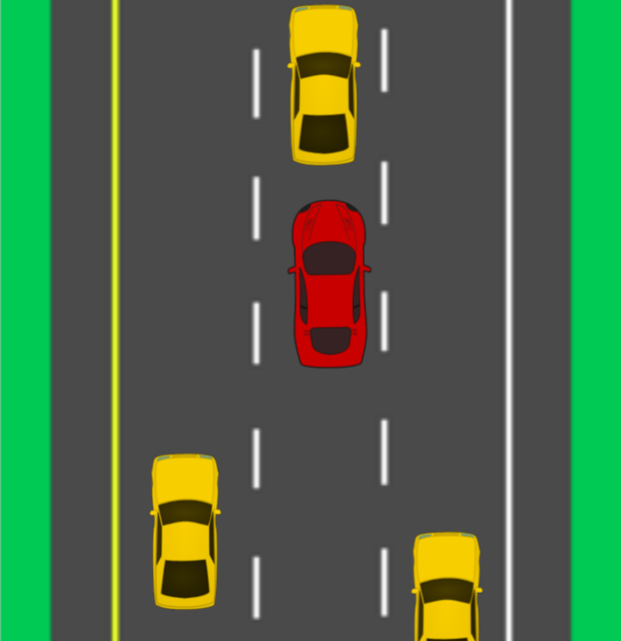

# CarND-Path-Planning-Project
Self-Driving Car Engineer Nanodegree Program

### Description
The goal of this project is to make a car in drive around a track in a simulated environment. This environment simulates the traffic in a highway. 
The car should go around the track without causing any incidents:
- the acceleration and and jerk shall not exceed a maximum value to ensure a comfortable ride
- collision with other vehicles must be avoided 
- the car should drive in the middle of the lane
The car should also drive at a speed near the speed limit when ever possible and pass slower traffic.

<center>
   
</center>
## Planner
The Planner class realizes different modules:
### Sensor Fusion: 
this module gets a list of attributes of other cars in the traffic and realizes the following :
- determining the speed of each lane
- saves the vehicles in separate lists depending on the lane they are in
- finds the car in front in the same lane to avoid collision
### Path Planning:
This modules calculates the path the will follow. The path is generated as described below (approach from Q&A video):
- the remaining points from the previous path are added to the new path to ensure that the car follows a smooth path
- the new part of the path is generated using a spline with 5 anchor points
To ensure that the transition from the remaining points to the ones is smooth, the first 2 anchor points of the spline where set to be the lat 2 remaining points. The remaining 3 points are set by transforming the x,y-coordinates of the last previous point to s,d-coordinates and adding to the s-value. The d-value is set depending on the intended lane that was determined by the behavior planner. For example if the intended lane is to the left of the current lane 4.0 is subtracted from the last d-value. Using a spline makes sure that the transition is still smooth.  

Generating x,y-coordinates using the spline caused some problems. For instance, the x values must be in increasing order. My initial approach was to order the x values before generating the spline. If multiple points in the spine have the same x-value, I decided to generate the spline using the y values (spline(y) instead of spline(x)). I assumed that having unordered x and y values is impossible as this  would require the car to do  a compete turn. As this got more complicated I decided to use the approach from the Q&A video.   

The path planner module also determines whether the car need to speed up or slow down. The following behavior was implemented:
- the car will speed up to match the speed limit when possible (no collision)
- the car will slow down to match the speed of the vehicle in front of it.   

For slowing down 2 cases  where implemented. 
- in the normal case, slowing down happens with a rate of 1% the current speed of car
- in the emergency braking case (if to close to another car), slowing down happends with a rate of 1.5% the current speed of car

### Behavior Planning
This module is called less often and determines what the car will do next.
The behavior of the car is described using a the state machine from the lecture videos on behavior planing. 
Every time this module is called, possible next states are determined.
The cost of each of the steps is calculated, and the next step is chosen to be the one with the lowest cost. 
The value of the intended lane is set according to the chosen next state.


## Cost functions: 
The cost functions have to be chosen in a way that the car drives in a safe and efficient way.
To achieve this 3 cost functions where implemented:
-  **lane_speed_cost**:  this function determines how much each lane's speed deviates from the speed limit. Changing to states that result in a faster lane is rewarded. For example, in the image below, the middle lane is considered to be faster than the right lane.
<center>
   
</center>

- **safety_cost** : this function assures that the car only changes its lane if it is safe. In a situation like shown below the car would chose the right lane over the left one, because the s-offset to the car in the right lane is higher. Keeping the same lane is considered to be safe and has a cost of 0.
<center>
   
</center>

- **lane_position** : this cost function was introduced for efficiency reasons. It penalizes being in the left or right lane without considering the lane speed. This way the car would chose the middle lane if for example the road is empty. This is on average more efficient, as 2 different lanes can be reached from the middle lane. 

| configuration  |  lane_speed_cost | safety_cost | lane_position |
| :------------- | :--------------: | :----------: | -----------:| 
|  safe driving  | 1.0              |  1.0   (s-value +/-safe_dist)      | 0.0         | 
| efficient driving| 1.0 | 3.0 (s-value +/-15m)| 0.05|


## Simulator.
You can download the Term3 Simulator which contains the Path Planning Project from the [releases tab (https://github.com/udacity/self-driving-car-sim/releases/tag/T3_v1.2).  

To run the simulator on Mac/Linux, first make the binary file executable with the following command:
```shell
sudo chmod u+x {simulator_file_name}
```

## Basic Build Instructions

1. Clone this repo.
2. Make a build directory: `mkdir build && cd build`
3. Compile: `cmake .. && make`
4. Run it: `./path_planning`.


### The map of the highway is in data/highway_map.txt
Each waypoint in the list contains  [x,y,s,dx,dy] values. x and y are the waypoint's map coordinate position, the s value is the distance along the road to get to that waypoint in meters, the dx and dy values define the unit normal vector pointing outward of the highway loop.

The highway's waypoints loop around so the frenet s value, distance along the road, goes from 0 to 6945.554.


Here is the data provided from the Simulator to the C++ Program

#### Main car's localization Data (No Noise)

["x"] The car's x position in map coordinates

["y"] The car's y position in map coordinates

["s"] The car's s position in frenet coordinates

["d"] The car's d position in frenet coordinates

["yaw"] The car's yaw angle in the map

["speed"] The car's speed in MPH

#### Previous path data given to the Planner

//Note: Return the previous list but with processed points removed, can be a nice tool to show how far along
the path has processed since last time. 

["previous_path_x"] The previous list of x points previously given to the simulator

["previous_path_y"] The previous list of y points previously given to the simulator

#### Previous path's end s and d values 

["end_path_s"] The previous list's last point's frenet s value

["end_path_d"] The previous list's last point's frenet d value

#### Sensor Fusion Data, a list of all other car's attributes on the same side of the road. (No Noise)

["sensor_fusion"] A 2d vector of cars and then that car's [car's unique ID, car's x position in map coordinates, car's y position in map coordinates, car's x velocity in m/s, car's y velocity in m/s, car's s position in frenet coordinates, car's d position in frenet coordinates. 

## Details

1. The car uses a perfect controller and will visit every (x,y) point it recieves in the list every .02 seconds. The units for the (x,y) points are in meters and the spacing of the points determines the speed of the car. The vector going from a point to the next point in the list dictates the angle of the car. Acceleration both in the tangential and normal directions is measured along with the jerk, the rate of change of total Acceleration. The (x,y) point paths that the planner recieves should not have a total acceleration that goes over 10 m/s^2, also the jerk should not go over 50 m/s^3. (NOTE: As this is BETA, these requirements might change. Also currently jerk is over a .02 second interval, it would probably be better to average total acceleration over 1 second and measure jerk from that.

2. There will be some latency between the simulator running and the path planner returning a path, with optimized code usually its not very long maybe just 1-3 time steps. During this delay the simulator will continue using points that it was last given, because of this its a good idea to store the last points you have used so you can have a smooth transition. previous_path_x, and previous_path_y can be helpful for this transition since they show the last points given to the simulator controller with the processed points already removed. You would either return a path that extends this previous path or make sure to create a new path that has a smooth transition with this last path.

## Spline Lib

A really helpful resource for doing this project and creating smooth trajectories was using http://kluge.in-chemnitz.de/opensource/spline/, the spline function is in a single hearder file is really easy to use.

---

## Dependencies

* cmake >= 3.5
  * All OSes: [click here for installation instructions](https://cmake.org/install/)
* make >= 4.1
  * Linux: make is installed by default on most Linux distros
  * Mac: [install Xcode command line tools to get make](https://developer.apple.com/xcode/features/)
  * Windows: [Click here for installation instructions](http://gnuwin32.sourceforge.net/packages/make.htm)
* gcc/g++ >= 5.4
  * Linux: gcc / g++ is installed by default on most Linux distros
  * Mac: same deal as make - [install Xcode command line tools]((https://developer.apple.com/xcode/features/)
  * Windows: recommend using [MinGW](http://www.mingw.org/)
* [uWebSockets](https://github.com/uWebSockets/uWebSockets)
  * Run either `install-mac.sh` or `install-ubuntu.sh`.
  * If you install from source, checkout to commit `e94b6e1`, i.e.
    ```
    git clone https://github.com/uWebSockets/uWebSockets 
    cd uWebSockets
    git checkout e94b6e1
    ```
